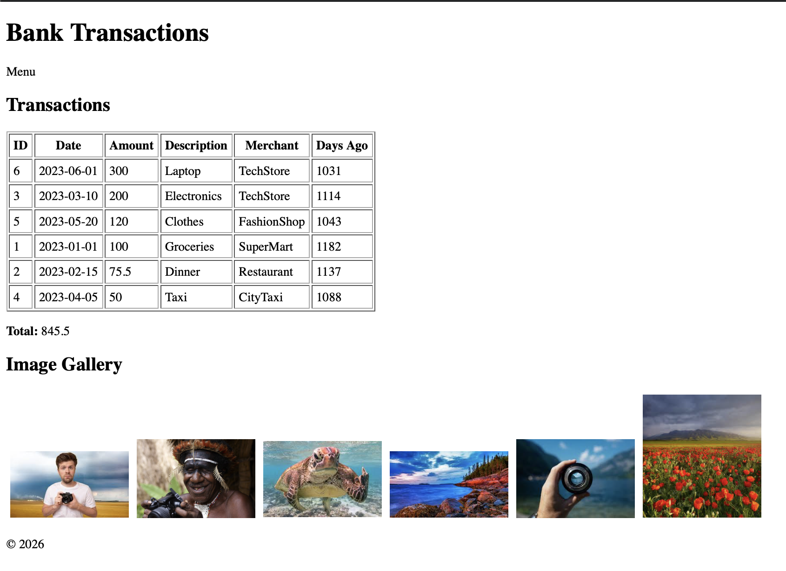

#  Лабораторная работа №4

## Массивы и функции в PHP

---

##  Цель работы

Освоить работу с массивами в PHP, включая:

* создание и обработку данных
* добавление и удаление элементов
* сортировку и поиск

Закрепить навыки работы с функциями:

* передача аргументов
* возвращаемые значения
* использование встроенных функций (`array_filter`, `usort`)

---

##  Структура проекта

```
lab4/
├── index.php
└── image/
```

* `index.php` — основной файл приложения
* `image/` — директория с изображениями (20–30 `.jpg` файлов)

---

##  Реализованный функционал

###  1. Работа с массивами

Создан массив `$transactions`, содержащий список банковских операций.

Каждая транзакция включает:

* `id` — уникальный идентификатор
* `date` — дата
* `amount` — сумма
* `description` — описание
* `merchant` — получатель

---

###  2. Вывод данных

Транзакции отображаются в виде HTML-таблицы с колонками:

* ID
* Date
* Amount
* Description
* Merchant
* Days Ago (разница в днях)

---

###  3. Реализованные функции

####  calculateTotalAmount

Подсчитывает общую сумму всех транзакций.

####  findTransactionByDescription

Ищет транзакции по части описания.

####  findTransactionById

Поиск транзакции по ID через `foreach`.

####  findTransactionByIdFilter

Поиск через `array_filter` (расширенный вариант).

####  daysSinceTransaction

Вычисляет количество дней между датой транзакции и текущей датой.

####  addTransaction

Добавляет новую транзакцию в массив.

---

###  4. Сортировка

Реализована с использованием `usort`:

* по дате
* по сумме (по убыванию)

---

###  5. Работа с файловой системой

Используется:

* `scandir()` — для получения списка файлов
* фильтрация `.` и `..`
* вывод изображений через ``

Результат — галерея изображений на странице.

---

##  Результат работы

Ниже приведён результат выполнения программы:



---

##  Запуск проекта

1. Перейти в папку проекта:

```
cd lab4
```

2. Запустить встроенный сервер PHP:

```
php -S localhost:8000
```

3. Открыть в браузере:

```
http://localhost:8000
```

---

##  Контрольные вопросы

###  Что такое массивы в PHP?

Массив — это структура данных, позволяющая хранить набор значений (индексированных или ассоциативных).

---

###  Как создать массив?

```php
$arr = [];
$arr = array();
```

---

###  Для чего используется foreach?

Цикл `foreach` используется для перебора элементов массива.

---

##  Вывод

В ходе работы были успешно освоены:

* работа с массивами
* создание и использование функций
* сортировка и фильтрация данных
* работа с файловой системой

Реализовано полноценное веб-приложение для отображения и управления транзакциями.
